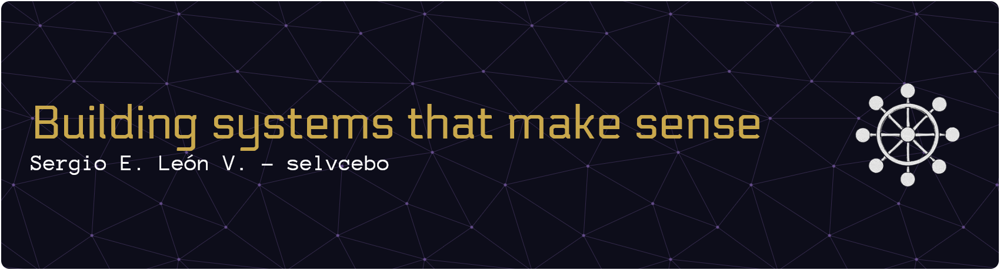

**Full-stack developer & software architecture enthusiast** · Medellín, Colombia 🇨🇴

Full-stack developer focused on **software architecture** — currently finishing a Technology degree in Software Analysis and Development at SENA, where I built [SoftwArt](https://github.com/selvcebo/backend-softwart), a real management system deployed in production for a local PYME.

Certified as a Programming Technician by SENA. Completed a Data Analysis, Machine Learning & AI course (SENA). My technical interest spans from system design down to the fundamentals of how language models actually work — knowing how to use tools isn't enough, I need to understand why they work.

I work extensively with AI-assisted development — not as a shortcut, but as a force multiplier. I understand enough of what's happening under the hood to know when to trust the output and when to push back.

---

Desarrollador full-stack con enfoque en **arquitectura de software** — actualmente finalizando la Tecnología en Análisis y Desarrollo de Software en el SENA, donde construí [SoftwArt](https://github.com/selvcebo/backend-softwart), un sistema de gestión real desplegado en producción para una PYME local.

Titulado como Técnico en Programación por el SENA. Cursé Análisis de Datos, Machine Learning e IA (SENA). Mi interés técnico va desde el diseño de sistemas hasta los fundamentos de cómo funcionan los modelos de lenguaje — no me alcanza con saber usar las herramientas, necesito entender por qué funcionan.

Trabajo extensamente con desarrollo asistido por IA — no como atajo, sino como multiplicador de capacidad. Entiendo suficiente de lo que pasa por debajo para saber cuándo confiar en el output y cuándo cuestionarlo.

---

## Philosophy / Filosofía

I think of software as a long-term craft, not disposable code. Every architectural decision I make has a reason I can explain — separation of concerns, decoupling, predictable failure modes. Documentation isn't an afterthought; it's the thread that makes a codebase accessible to anyone who comes after, regardless of their language or background.

Concibo el software como un oficio a largo plazo. Cada decisión de arquitectura que tomo tiene una razón que puedo explicar — separación de responsabilidades, desacoplamiento, modos de falla predecibles. La documentación no es un añadido tardío; es el hilo que hace el código accesible a quien venga después, sin importar su idioma o contexto.

---

## 🚀 Featured projects / Proyectos destacados

**[SoftwArt — Backend](https://github.com/selvcebo/backend-softwart)**
REST API for a real PYME management system. Node.js + Express + TypeScript + TypeORM + PostgreSQL. MVC architecture, JWT auth with role-based access control, flexible installment payment model, atomic transactions, custom error hierarchy. Deployed on Render + Supabase.

API REST para un sistema de gestión PYME real. Arquitectura MVC, auth JWT con control de acceso por rol, modelo de abonos flexible, transacciones atómicas, jerarquía de errores custom. Desplegado en Render + Supabase.

**[SoftwArt — Frontend](https://github.com/selvcebo/frontend-softwart-2)**
Admin panel + client portal. React + TypeScript + Vite + Tailwind + shadcn/ui. Feature-based architecture, real-time availability TimePicker, installment modal with live preview, dual auth storage strategy. Live at [softwart.online](https://softwart.online).

Panel admin + portal de clientes. Arquitectura feature-based, TimePicker con disponibilidad en tiempo real, modal de abonos con preview en vivo, estrategia de auth dual. En producción en [softwart.online](https://softwart.online).

**[SoftwArt — Mobile](https://github.com/selvcebo/mobile-softwart)**
Android companion app built with Flutter + Clean Architecture (data / domain / presentation). Provider for state management, warmup ping to avoid cold starts on Render's free tier. APK release generated (~49 MB).

App Android complementaria con Flutter + Clean Architecture. Provider para estado, ping de warmup para evitar cold starts. APK release generado.

**[KNN-pacients](https://github.com/selvcebo/KNN-pacients)**
End-to-end KNN classification pipeline with scikit-learn, bilingual documentation.
Pipeline de clasificación KNN con scikit-learn, documentación bilingüe.

---

## 🛠 Tech stack

### Languages / Lenguajes

### Frameworks & libraries / Frameworks y librerías

### Databases & tools / Bases de datos y herramientas

### Deploy / Despliegue

### AI tools / Herramientas de IA

---

## 📈 GitHub Stats / Estadísticas

---

## 📫 Contact / Contacto

GitHub: [github.com/selvcebo](https://github.com/selvcebo)
Email: selvsena@gmail.com
